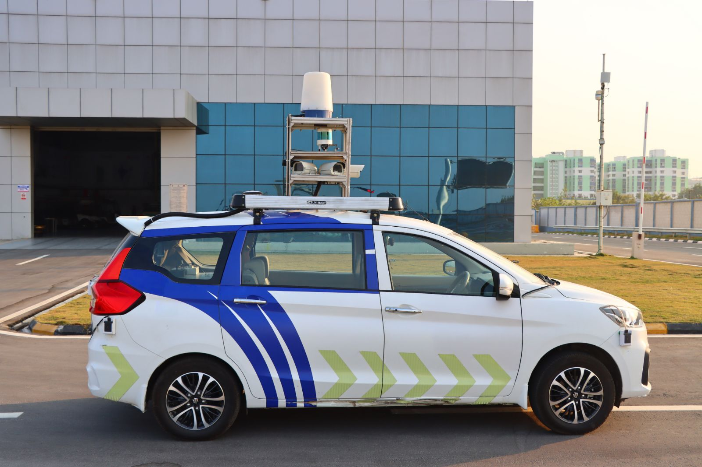
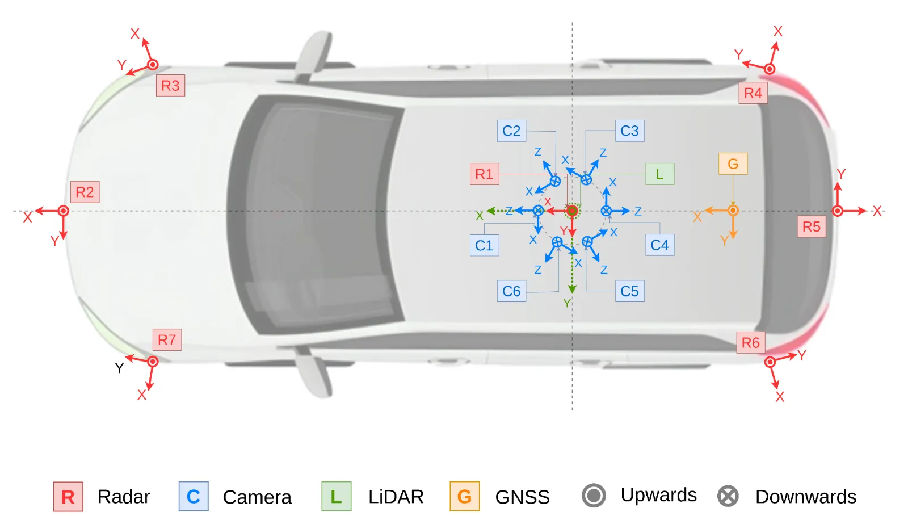

**TIAND – A Large-Scale Multimodal Dataset for Autonomous Driving in Complex Indian Traffic**

The dataset provides synchronized multimodal sensor data collected across diverse traffic conditions in India. It supports research in **autonomous driving perception, multimodal sensor fusion, radar perception, and domain generalization**.

---

# Dataset Overview

* **77 hours of driving**
* **5600+ km recorded**
* **20+ cities**
* **20,000+ synchronized frames**
## Data Collection Vehicle

<p align="center">
  
</p>

<p align="center">
<b>Figure: Data collection vehicle equipped with the
multimodal sensor suite.</b>
</p>


All sensors are synchronized through a unified data acquisition system.

---

## Sensor Configuration

<p align="center">
  
</p>

<p align="center">
<b>Figure:  Representative locations across multiple Indian cities
where data were collected.</b>
</p>


The dataset captures complex real-world scenarios including:

* dense urban traffic
* heterogeneous road participants
* weak lane discipline
* varied lighting conditions
* crowded intersections
* mixed traffic environments

These challenges make the dataset suitable for developing robust perception systems.

---

# Sensor Configuration

The dataset includes multiple sensors providing **360° perception**.

| Sensor  | Configuration            |
| ------- | ------------------------ |
| Cameras | 6 RGB cameras            |
| LiDAR   | 128-channel LiDAR        |
| Radar   | Automotive radar sensors |
| Navtech | Imaging radar            |
| GNSS    | GPS positioning          |
| IMU     | Vehicle motion sensing   |

---

# Dataset Modalities

## Camera

* ~125K images
* ~60K annotated images
* 26 object classes

## LiDAR

* ~45K point cloud frames
* ~10K annotated frames
* 19 object classes

## Radar

* ~2.4M radar detections

---

# Dataset Root Structure

```
MULTIMODAL_DATASET_ROOT
│
├── Cities
│   │
│   ├── Agra
│   ├── Amritsar
│   ├── Bhilai
│   ├── Chandigharh
│   ├── Dasuya
│   ├── Delhi
│   ├── Faridabad
│   ├── Gurgram
│   ├── Gwalior
│   ├── Hyderabad
│   ├── Indoor_morning
│   ├── indore_noon
│   ├── Jabbalpur
│   ├── Kota
│   ├── Nanded
│   ├── Nijamabad
│   ├── Pathankot
│   ├── Patiala
│   ├── Patnitop
│   ├── Udhampur
│   └── Ujjain
│
│   │
│   └── CITY_STRUCTURE
│       │
│       ├── Camera
│       │   ├── Scene1
│       │   │   ├── camera1
│       │   │   │   ├── 0001.png
│       │   │   │   ├── 0001.txt
│       │   │   │   └── ...
│       │   │   ├── camera2
│       │   │   │   ├── 0001.png
│       │   │   │   ├── 0001.txt
│       │   │   │   └── ...
│       │   │   ├── camera3
│       │   │   │   ├── 0001.png
│       │   │   │   ├── 0001.txt
│       │   │   │   └── ...
│       │   │   ├── camera4
│       │   │   │   ├── 0001.png
│       │   │   │   ├── 0001.txt
│       │   │   │   └── ...
│       │   │   ├── camera5
│       │   │   │   ├── 0001.png
│       │   │   │   ├── 0001.txt
│       │   │   │   └── ...
│       │   │   └── camera6
│       │   │       ├── 0001.png
│       │   │       ├── 0001.txt
│       │   │       └── ...
│       │   │
│       │   ├── Scene2
│       │   │   ├── camera1
│       │   │   ├── camera2
│       │   │   ├── camera3
│       │   │   ├── camera4
│       │   │   ├── camera5
│       │   │   └── camera6
│       │   │
│       │   ├── Scene3
│       │   │   ├── camera1
│       │   │   ├── camera2
│       │   │   ├── camera3
│       │   │   ├── camera4
│       │   │   ├── camera5
│       │   │   └── camera6
│       │   │
│       │   ├── Scene4
│       │   │   ├── camera1
│       │   │   ├── camera2
│       │   │   ├── camera3
│       │   │   ├── camera4
│       │   │   ├── camera5
│       │   │   └── camera6
│       │   │
│       │   └── Scene5
│       │       ├── camera1
│       │       ├── camera2
│       │       ├── camera3
│       │       ├── camera4
│       │       ├── camera5
│       │       └── camera6
│       │
│       ├── Gnss
│       │   ├── Scene1
│       │   ├── Scene2
│       │   ├── Scene3
│       │   ├── Scene4
│       │   └── Scene5
│       │       │
│       │       ├── imu
│       │       │   ├── gps_imu.csv
│       │       │   └── imu_data_raw.csv
│       │       │
│       │       └── novatel
│       │           ├── novatel_oem7_inspva.csv
│       │           └── novatel_oem7_odom.csv
│       │
│       ├── Lidar
│       │   ├── Scene1
│       │   ├── Scene2
│       │   ├── Scene3
│       │   ├── Scene4
│       │   └── Scene5
│       │       │
│       │       ├── camera
│       │       │   ├── back
│       │       │   ├── back_left
│       │       │   ├── back_right
│       │       │   ├── front
│       │       │   ├── front_left
│       │       │   └── front_right
│       │       │
│       │       ├── label
│       │       │   ├── 0001.json
│       │       │   ├── 0002.json
│       │       │   └── ...
│       │       │
│       │       └── lidar
│       │           ├── 0001.pcd
│       │           ├── 0002.pcd
│       │           └── ...
│       │
│       ├── Navtech
│       │   ├── Scene1
│       │   ├── Scene2
│       │   ├── Scene3
│       │   ├── Scene4
│       │   └── Scene5
│       │       │
│       │       └── navtech
│       │           ├── timestamp_1.png
│       │           ├── timestamp_2.png
│       │           └── ...
│       │
│       └── Radar
│           ├── Scene1
│           ├── Scene2
│           ├── Scene3
│           ├── Scene4
│           └── Scene5
│               │
│               └── radar
│                   ├── radar_img.csv
│                   └── radar_obj.csv
│
└── projection
    │
    ├── Camera + LiDAR
    │   │
    │   ├── Agra
    │   ├── Amritsar
    │   ├── Bhilai
    │   ├── Chandigarh
    │   ├── Dasuya
    │   ├── Delhi
    │   ├── Faridabad
    │   ├── Gurgram
    │   ├── Gwalior
    │   ├── Hyderabad
    │   ├── Indore_Afternoon
    │   ├── Indore_Mrng
    │   ├── Jabbalpur
    │   ├── Kota
    │   ├── Nanded
    │   ├── Nizamabad
    │   ├── Pathankot
    │   ├── Patiala
    │   ├── Patnitop
    │   ├── Udhampur
    │   └── Ujjain
    │       │
    │       ├── Scene1
    │       │   ├── Camera
    │       │   │   ├── back
    │       │   │   ├── back_left
    │       │   │   ├── back_right
    │       │   │   ├── front
    │       │   │   ├── front_left
    │       │   │   └── front_right
    │       │   │
    │       │   └── LiDAR
    │       │       ├── 0001.pcd
    │       │       ├── 0001.json
    │       │       ├── 0002.pcd
    │       │       ├── 0002.json
    │       │       └── ...
    │       │
    │       ├── Scene2
    │       ├── Scene3
    │       ├── Scene4
    │       └── Scene5
    │
    └── Camera + Radar
        │
        └── SYNC
            │
            ├── Agra
            ├── Amritsar
            ├── Bhilai
            ├── Chandigarh
            ├── Dasuya
            ├── Delhi
            ├── Faridabad
            ├── Gurgram
            ├── Gwalior
            ├── Hyderabad
            ├── Indore_Afternoon
            ├── Indore_Mrng
            ├── Jabbalpur
            ├── Kota
            ├── Nanded
            ├── Nizamabad
            ├── Pathankot
            ├── Patiala
            ├── Patnitop
            ├── Udhampur
            └── Ujjain
                │
                ├── Scene1
                │   ├── camera_radar_sync
                │   ├── Cameras
                │   ├── Radars
                │   ├── dataset_summary.txt
                │   └── README.md
                │
                ├── Scene2
                ├── Scene3
                ├── Scene4
                └── Scene5
```


# Benchmark Experiments

Baseline experiments are included for perception tasks.

### Camera Detection

* YOLOv26
* RT-DETR

### LiDAR Detection

* RANSAC Ground Segmentation
* Euclidean Clustering

### Radar Detection

* DBSCAN Clustering

---

# Multimodal Projections

The repository includes tools for multimodal projection:

* Camera → LiDAR projection
* Camera → Radar projection
* synchronized sensor visualization

These projections enable sensor fusion research.

---

# Research Applications

The dataset supports research in:

* Autonomous Driving Perception
* Multimodal Sensor Fusion
* Radar-based Object Detection
* Domain Generalization
* Long-range Object Detection
* Camera-LiDAR Fusion
* Camera-Radar Fusion


